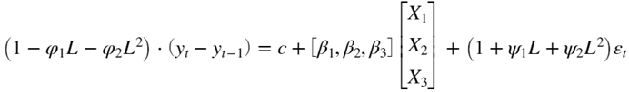
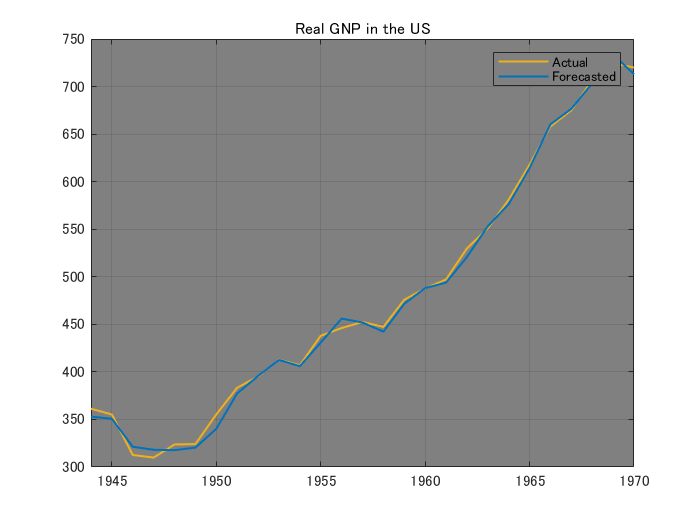
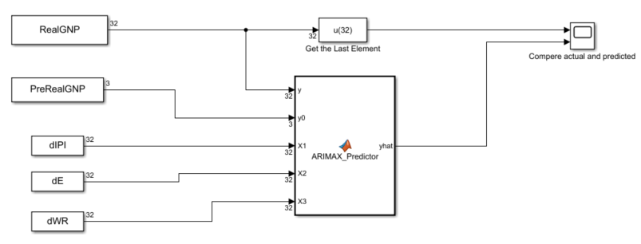

# ARIMAX モデルによる実質 GNP の再帰的予測


当サンプルは Econometrics Toolbox によって提供される ARIMAX モデルを Simulink へ実装する方法を示します。具体的には、ARIMAX(2,1,2) を用いて米国における実質 GNP を 工業生産指数 (`IPI`)、 雇用率 (`E`)、そして実質賃金 (`WR`) の階差を外生変数として再帰的に推定します 





ただし、


: Lag operator ()


: 工業生産指数の階差 


: 雇用率の階差 


: 実質賃金の階差 


  


尚、当サンプルは Econometrics Toolbox によって提供されるこちらの例題に基づいております


[https://www.mathworks.com/help/econ/specify-presample-and-forecast-period-data-to-forecast-arimax-model.html](https://jp.mathworks.com/help/econ/specify-presample-and-forecast-period-data-to-forecast-arimax-model.html)


[https://www.mathworks.com/help/econ/rolling-window-estimation-of-state-space-models.html](https://www.mathworks.com/help/econ/rolling-window-estimation-of-state-space-models.html)


# 1: 年次経済データをインポート

```matlab:Code
load Data_NelsonPlosser
```


※) 当経済データは米国のものです


# 2: インポートしたデータを前処理 

```matlab:Code
isNaN = any(ismissing(DataTable),2); % Flag periods containing NaNs
y  = DataTable.GNPR(~isNaN);
y(1) = []; % remove the 1st element because of taking the difference of exogenous variables

IX = DataTable{~isNaN,["IPI" "E" "WR"]};
X  = diff(IX,1); % compute the row-wise difference
X1 = X(:,1);
X2 = X(:,2);
X3 = X(:,3);
```

  
# 3: 前処理したデータから時間付き部分時系列配列を作成


Simulink の "From Workspace" ブロック用に時間付き部分時系列配列を作成します


```matlab:Code
P = 2; % degree of AR terms
D = 1;

WindowSize = 31;
ForecastPeriod  = numel(y) - WindowSize - P - D;

yyT = zeros(ForecastPeriod, WindowSize+P+D+1);
XX1 = zeros(ForecastPeriod, WindowSize+1);
XX2 = zeros(ForecastPeriod, WindowSize+1);
XX3 = zeros(ForecastPeriod, WindowSize+1);

m = 1;
for nYear = 1:ForecastPeriod
    yyT(nYear,:) = transpose(y(m:m+WindowSize+P+D));
    XX1(nYear,:) = transpose(X1(m+P+D:m+WindowSize+P+D));
    XX2(nYear,:) = transpose(X2(m+P+D:m+WindowSize+P+D));
    XX3(nYear,:) = transpose(X3(m+P+D:m+WindowSize+P+D));
    m = m + 1;
end

yy0 = yyT(:,1:P+D);
yyT = yyT(:,1+P+D:end);

Time = str2double(DataTable.Properties.RowNames(~isNaN));
Time = Time((end-ForecastPeriod+1:end));

% Targeted Time Series
RealGNP = [Time, yyT];
PreRealGNP = [Time, yy0];

% Exogenous variables
dIPI = [Time, XX1];
dE   = [Time, XX2]; 
dWR  = [Time, XX3];
```

# 4: ARIMAX(2,1,2) モデルのパラメータ推定および翌年の実質 GNP の推定を再帰的に実施 (MATLAB編)

```matlab:Code
eGNPR = zeros(numel(Time),1);

for t = 0:numel(Time)-1
    sY = yyT(t+1,:)';
    sX = [XX1(t+1,:); XX2(t+1,:); XX3(t+1,:)]';
    Mdl = arima(P,D,2);
    Mdl = estimate(Mdl,sY(1:end-1),'Y0',yy0(t+1,:)','X',sX(1:end-1,:),'Display','off');
    eGNPR(t+1) = forecast(Mdl,1,sY(end-P-D:end-1),'X0',sX(end-2:end-1,:),'XF',sX(end,:));
end
```

# 5: 実際の実質 GNP と MATLAB にて推定された実質 GNP をプロット

```matlab:Code
figure; axH = axes;
plot(axH, Time, y(end-numel(Time)+1:end), 'Color', [0.9290 0.6940 0.1250], 'LineWidth', 1.2);
hold(axH, 'on'); grid(axH, 'on');
plot(axH, Time, eGNPR, 'Color', [0 0.4470 0.7410], 'LineWidth', 1.2);
axH.XLim(1) = Time(1);
axH.Color = [0.5020 0.5020 0.5020];
axH.Title.String = 'Real GNP in the US';
legend(["Actual", "Forecasted"])
```




# 6: Simulink モデルの開示とパラメータ設定 





```matlab:Code
mdl = 'recursive_arimax_model_update';
open_system(mdl);

set_param(mdl, 'Solver', 'FixedStepAuto');
set_param(mdl, 'FixedStep', '1');
set_param(mdl, 'StartTime', num2str(Time(1)));
set_param(mdl, 'StopTime',  num2str(Time(end)));
```

# 7: ARIMAX(2,1,2) モデルのパラメータ推定および翌年の実質 GNP の推定を再帰的に実施 (Simulink編) 

```matlab:Code
out = sim(mdl);
```

# 8: 実際の実質 GNP と Simulink にて推定された実質 GNP をプロット

```matlab:Code
figure; axH = axes;
plot(axH, Time, out.ScopeOut.signals(1).values, 'Color', [0.9290 0.6940 0.1250], 'LineWidth', 1.2);
hold(axH, 'on'); grid(axH, 'on');
plot(axH, Time, out.ScopeOut.signals(2).values, 'Color', [0 0.4470 0.7410], 'LineWidth', 1.2);
axH.XLim(1) = Time(1);
axH.Color = [0.5020 0.5020 0.5020];
axH.Title.String = 'Real GNP in the US';
legend(["Actual", "Forecasted"])
```


# 9: MATLAB と Simulink の一致性検証

```matlab:Code
isequal(out.ScopeOut.signals(2).values, eGNPR)
```


```text:Output
ans = 
   1

```

