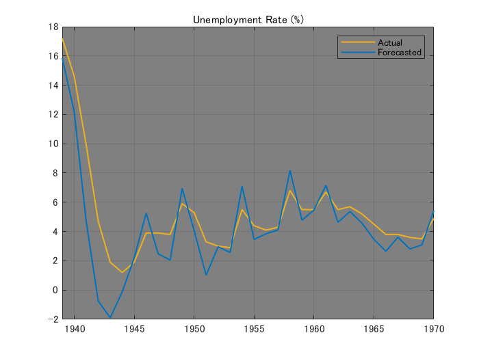
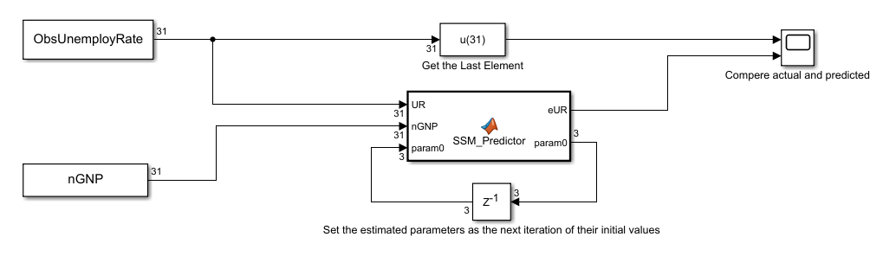

# 状態空間モデルによる失業率の再帰的予測


当サンプルは Econometrics Toolbox によって提供される状態空間モデルを Simulink モデルへ実装する方法を示します。ここでは以下のような線型な状態空間モデルを用いて米国における翌年の失業率を再帰的に推定しす


  


  


ただし、


 


  


尚、当サンプルは Econometrics Toolbox によって提供されるこちらの例題に基づいております


[https://www.mathworks.com/help/econ/choose-state-space-model-specification-using-backtesting.html](https://www.mathworks.com/help/econ/choose-state-space-model-specification-using-backtesting.html)


[https://jp.mathworks.com/help/econ/rolling-window-estimation-of-state-space-models.html](https://jp.mathworks.com/help/econ/rolling-window-estimation-of-state-space-models.html)


# 1: 年次経済データをインポート

```matlab:Code
load Data_NelsonPlosser
```


※) 当経済データは米国のものです


# 2: インポートしたデータを前処理 

```matlab:Code
isNaN = any(ismissing(DataTable),2); % Flag periods containing NaNs
Z = DataTable.GNPN(~isNaN); % Nominal GNP
y = DataTable.UR(~isNaN); % Unemployment rate
```

# 3: 前処理したデータから時間付き部分時系列配列を作成


Simulink の "From Workspace" ブロック用に時間付き部分時系列配列を作成します


```matlab:Code
WindowSize = 31;
ForecastPeriod  = numel(y) - WindowSize + 1;

ZZ = zeros(ForecastPeriod, WindowSize);
yy = zeros(ForecastPeriod, WindowSize);

m = 1;
for nYear = 1:ForecastPeriod
    ZZ(nYear,:) = transpose(Z(m:m+WindowSize-1));
    yy(nYear,:) = transpose(y(m:m+WindowSize-1));
    m = m + 1;
end

Time = str2double(DataTable.Properties.RowNames(~isNaN));
Time = Time((end-ForecastPeriod+1:end));

% create arrays of sub time-series with time
ObsUnemployRate = [Time, yy];
nGNP = [Time, ZZ];
```

# 4: 状態空間モデルによるパラメータ推定および翌年の失業率の推定を再帰的に実施 (MATLAB編)


Simulink によるシミュレーションの実行前に、モデルの係数  に対するフィッティングと翌年の失業率の推定を MATLAB 上にて再帰的に実施します


```matlab:Code
eUR = zeros(numel(Time),1);
param0 = [0.5; 0.1; -20]; % initialize paramters

for t = 0:numel(Time)-1
    dlZ = diff(log(ZZ(t+1,:)))';
    dy  = diff(yy(t+1,:))';
    Mdl = ssm(@(c)rwAR2ParamMap(c,dy,dlZ));
    [Mdl, param0] = estimate(Mdl, dy, param0, 'Display', 'off');
    dyhat = forecast(Mdl, 1, dy,'Predictors0',dlZ,'PredictorsF',dlZ(end),'Beta',param0(end));
    eUR(t+1) = dyhat + yy(t+1,end);
end
```

# 5: 実際の失業率と MATLAB にて推定された失業率をプロット

```matlab:Code
figure; axH = axes;
plot(axH, Time, y(end-numel(Time)+1:end), 'Color', [0.9290 0.6940 0.1250], 'LineWidth', 1.2);
hold(axH, 'on'); grid(axH, 'on');
plot(axH, Time, eUR, 'Color', [0 0.4470 0.7410], 'LineWidth', 1.2);
axH.XLim(1) = Time(1);
axH.Color = [0.5020 0.5020 0.5020];
axH.Title.String = 'Unemployment Rate (%)';
legend(["Actual", "Forecasted"])
```




# 6: Simulink モデルの開示とパラメータ設定





```matlab:Code
mdl = 'recursive_ssm_update';
open_system(mdl);

set_param(mdl, 'Solver', 'FixedStepAuto');
set_param(mdl, 'FixedStep', '1');
set_param(mdl, 'StartTime', num2str(Time(1)));
set_param(mdl, 'StopTime',  num2str(Time(end)));
```

# 7: 状態空間モデルによるパラメータ推定および翌年の失業率の推定を再帰的に実施 (Simulink編)

```matlab:Code
out = sim(mdl);
```

# 8: 実際の失業率と Simulink にて推定された失業率をプロット

```matlab:Code
figure; axH = axes;
plot(axH, Time, out.ScopeOut.signals(1).values, 'Color', [0.9290 0.6940 0.1250], 'LineWidth', 1.2);
hold(axH, 'on'); grid(axH, 'on');
plot(axH, Time, out.ScopeOut.signals(2).values, 'Color', [0 0.4470 0.7410], 'LineWidth', 1.2);
axH.XLim(1) = Time(1);
axH.Color = [0.5020 0.5020 0.5020];
axH.Title.String = 'Unemployment Rate (%)';
legend(["Actual", "Forecasted"])
```


# 9: MATLAB と Simulink の一致性検証 

```matlab:Code
isequal(out.ScopeOut.signals(2).values, eUR)
```


```text:Output
ans = 
   1

```

